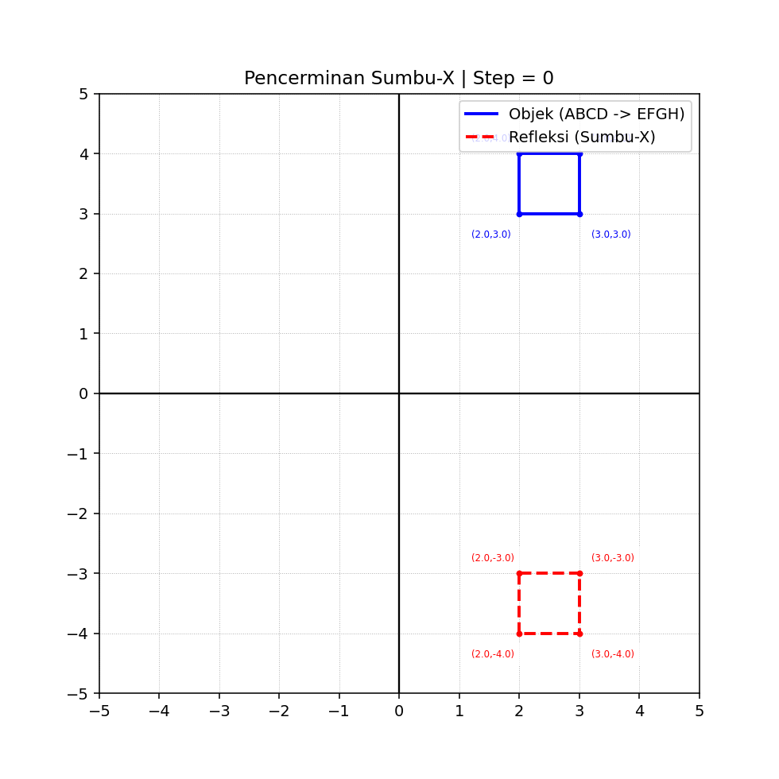

# Transformasi Geometri: Pencerminan Sumbu-X

Halaman ini mendemonstrasikan simulasi transformasi geometri berupa **pencerminan (refleksi) terhadap Sumbu-X** yang digabungkan dengan **pergeseran (translasi) turun secara vertikal**.

---

## 1. Animasi Simulasi ($ABCD \rightarrow EFGH$)

Berikut adalah hasil visualisasi animasi bergerak dari pergerakan objek asli (Biru) yang bergerak turun dari koordinat awal $ABCD$ menuju $EFGH$, diikuti oleh bayangannya (Merah) yang bergerak naik secara simetris di bawah cermin Sumbu-X:



---

## 2. Kode Python (Source Code)

Gunakan kode Python berikut di VS Code Anda untuk menghasilkan file `animasi.gif` di atas:

```python
import os
import numpy as np
import matplotlib.pyplot as plt
from matplotlib.animation import FuncAnimation

# ==========================================
# OBJEK AWAL (ABCD) - Urutan memutar searah jarum jam
# ==========================================
objek = np.array([
    [2, 3],
    [2, 4],
    [3, 4],
    [3, 3],
    [2, 3]
])

# ==========================================
# TRANSFORMASI (Pencerminan terhadap Sumbu-X)
# ==========================================
R = np.array([
    [1,  0],
    [0, -1]
])

def T(tx, ty):
    return np.array([
        [1, 0, tx],
        [0, 1, ty],
        [0, 0, 1]
    ])

def ke_homogen(obj):
    return np.hstack((obj, np.ones((obj.shape[0], 1))))

def ke_cartesian(obj):
    return obj[:, :2]

# ==========================================
# LABEL KOORDINAT
# ==========================================
def gambar_label(points, warna, arah):
    if arah == 'atas':
        offsets = [
            (-0.8, -0.4),  # A
            (-0.8, 0.2),   # B
            (0.2, 0.2),    # C
            (0.2, -0.4)    # D
        ]
    else:  # Untuk bayangan di bawah sumbu-X
        offsets = [
            (-0.8, 0.2),
            (-0.8, -0.4),
            (0.2, -0.4),
            (0.2, 0.2)
        ]

    for i, (x, y) in enumerate(points[:-1]):
        dx, dy = offsets[i % 4]
        ax.plot(x, y, 'o', color=warna, markersize=3)
        ax.text(
            x + dx, y + dy,
            f"({x:.1f},{y:.1f})",
            fontsize=6,
            color=warna,
            bbox=dict(facecolor='white', alpha=0.7, edgecolor='none')
        )

# ==========================================
# SETUP PLOT
# ==========================================
plt.rcParams['figure.dpi'] = 140
fig, ax = plt.subplots(figsize=(7, 7))

total_frames = 15
max_translation = -2.0  # Bergerak turun sejauh 2 satuan (dari y=3 ke y=1)

def update(frame):
    ax.clear()

    # Grid & Limit Canvas
    ax.set_xlim(-5, 5)
    ax.set_ylim(-5, 5)
    ax.set_aspect('equal')

    # Sumbu utama
    ax.axhline(0, color='black', linewidth=1.2)
    ax.axvline(0, color='black', linewidth=1.2)

    # Grid rapat berurutan
    ax.set_xticks(np.arange(-5, 6, 1))
    ax.set_yticks(np.arange(-5, 6, 1))
    ax.grid(True, linewidth=0.5, linestyle=':')

    # PROSES GERAK (TRANSLASI & REFLEKSI)
    ty = (frame / (total_frames - 1)) * max_translation
    obj_h = ke_homogen(objek)

    # 1. Objek Asli: Turun Vertikal (ABCD -> EFGH)
    asli = (T(0, ty) @ obj_h.T).T
    asli = ke_cartesian(asli)

    # 2. Refleksi Awal di Sumbu-X
    refleksi_awal = (R @ objek.T).T
    refleksi_h = ke_homogen(refleksi_awal)

    # 3. Gerak Bayangan: Naik Vertikal (arahnya berlawanan)
    refleksi = (T(0, -ty) @ refleksi_h.T).T
    refleksi = ke_cartesian(refleksi)

    # Gambar Garis Objek & Bayangan
    ax.plot(asli[:, 0], asli[:, 1], 'b-', linewidth=2, label='Objek (ABCD -> EFGH)')
    ax.plot(refleksi[:, 0], refleksi[:, 1], 'r--', linewidth=2, label='Refleksi (Sumbu-X)')

    # Berikan Label Koordinat dinamis
    gambar_label(asli, 'blue', 'atas')
    gambar_label(refleksi, 'red', 'bawah')

    ax.legend(loc='upper right')
    ax.set_title(f"Pencerminan Sumbu-X | Step = {frame}")

# Membuat dan Menyimpan Animasi langsung menjadi GIF
anim = FuncAnimation(fig, update, frames=total_frames, interval=300, repeat=True)

output_filename = 'animasi.gif'
anim.save(output_filename, writer='pillow', fps=3)

```

# Penjelasan Pengerjaan Transformasi Matriks 2D

Proses pergeseran (translasi) dan pencerminan (refleksi) pada simulasi ini diselesaikan secara matematis menggunakan **Sistem Koordinat Homogen** 3D agar semua operasi transformasi dapat dihitung melalui perkalian matriks linier.

Koordinat Kartesian 2D [x, y] dikonversi menjadi koordinat homogen [x, y, 1].

---

# 1. Transformasi Objek Asli

A = (-0.8, -0.4)
B = (-0.8, 0.2), 
C = (0.2, 0.2),   
D = (0.2, -0.4)

Objek asli bergerak turun secara vertikal dari posisi awal ABCD ke posisi akhir EFGH.

Pergerakan ini merupakan **translasi** pada sumbu-Y sebesar (t_y), sedangkan sumbu-X tidak mengalami pergeseran (t_x = 0).

## A. Matriks Translasi Homogen (T)

$$
T(0, t_y) =
\begin{bmatrix}
1 & 0 & 0 \\
0 & 1 & t_y \\
0 & 0 & 1
\end{bmatrix}
$$

## B. Contoh Perhitungan Titik A(2,3) menjadi E(2,1)

Diketahui translasi vertikal:

$$
t_y = -2
$$

Maka:

$$
E = T(0, -2) \cdot A
$$

$$
\begin{bmatrix}
x_E \\
y_E \\
1
\end{bmatrix}
=
\begin{bmatrix}
1 & 0 & 0 \\
0 & 1 & -2 \\
0 & 0 & 1
\end{bmatrix}
\begin{bmatrix}
2 \\
3 \\
1
\end{bmatrix}
$$

Perkalian baris × kolom:

$$
x_E = (1 \cdot 2) + (0 \cdot 3) + (0 \cdot 1) = 2
$$

$$
y_E = (0 \cdot 2) + (1 \cdot 3) + (-2 \cdot 1) = 3 - 2 = 1
$$

$$
\text{Skala homogen} = (0 \cdot 2) + (0 \cdot 3) + (1 \cdot 1) = 1
$$

Sehingga diperoleh koordinat akhir:

$$
E(2,1)
$$

---

# 2. Transformasi Objek Bayangan (Refleksi Sumbu-X)

Bayangan objek harus selalu simetris terhadap sumbu-X \((y = 0)\).

Transformasi bayangan dilakukan melalui dua tahap:

1. Refleksi terhadap sumbu-X
2. Translasi berlawanan arah

---

## A. Tahap 1: Refleksi Posisi Awal

Matriks refleksi terhadap sumbu-X:

$$
R =
\begin{bmatrix}
1 & 0 \\
0 & -1
\end{bmatrix}
$$

Untuk titik awal \(A(2,3)\):

$$
A'_{\text{refleksi}}
=
\begin{bmatrix}
1 & 0 \\
0 & -1
\end{bmatrix}
\begin{bmatrix}
2 \\
3
\end{bmatrix}
$$

Hasil perkalian:

$$
=
\begin{bmatrix}
(1 \cdot 2) + (0 \cdot 3) \\
(0 \cdot 2) + (-1 \cdot 3)
\end{bmatrix}
=
\begin{bmatrix}
2 \\
-3
\end{bmatrix}
$$

Diperoleh titik bayangan awal:

$$
A'(2,-3)
$$

---

## B. Tahap 2: Translasi Berlawanan Arah

Ketika objek asli bergerak turun sebesar (t_y), maka bayangan bergerak naik sebesar (-t_y) agar tetap simetris terhadap sumbu-X.

Jika objek asli mengalami translasi:

$$
t_y = -2
$$

Maka translasi bayangan:

$$
-t_y = 2
$$

Perhitungan titik bayangan akhir:

$$
E' = T(0,2) \cdot A'_{\text{refleksi}}
$$

$$
\begin{bmatrix}
x_{E'} \\
y_{E'} \\
1
\end{bmatrix}
=
\begin{bmatrix}
1 & 0 & 0 \\
0 & 1 & 2 \\
0 & 0 & 1
\end{bmatrix}
\begin{bmatrix}
2 \\
-3 \\
1
\end{bmatrix}
$$

Perkalian baris × kolom:

$$
x_{E'} = (1 \cdot 2) + (0 \cdot -3) + (0 \cdot 1) = 2
$$

$$
y_{E'} = (0 \cdot 2) + (1 \cdot -3) + (2 \cdot 1) = -3 + 2 = -1
$$

$$
\text{Skala homogen} = (0 \cdot 2) + (0 \cdot -3) + (1 \cdot 1) = 1
$$

Sehingga diperoleh koordinat bayangan akhir:

$$
E'(2,-1)
$$

Posisi \(E'(2,-1)\) merupakan bayangan simetris dari titik \(E(2,1)\) terhadap sumbu-X.